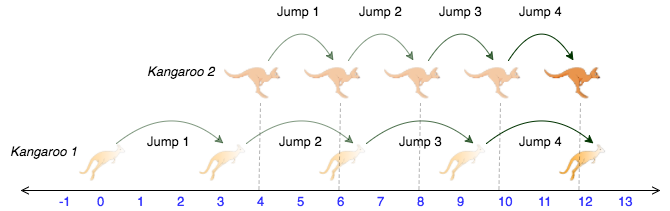

# Ejercicio-04

Tenemos dos canguros que corren juntos y debemos saber si se pueden o no juntar escribiendo una funcion.
* El primer canguro comienza desde la posicion x1 y se mueve a una velocidad v1 (metros por salto).
* El segundo canguro comienza desde la posicion x2 y se mueve a una velocidad v2 (metros por salto).

La funcion debe devolver YES si los canguros se pueden juntar, NO en caso contrario.



Abra el proyecto y finalice la funcion.

```
string kangaroo(int x1, int v1, int x2, int v2) {

}
```

> Si desea usar Visual Studio 2019, abra ./project/Ejercicio-01.2019.sln

---

### Pasos para descargar Visual Studio Community Edition 2022

*	Descargar Visual Studio Community Edition desde el siguiente Link -> [Visual Studio Community Edition Link](https://visualstudio.microsoft.com/es/thank-you-downloading-visual-studio/?sku=Community&channel=Release&version=VS2022&source=VSLandingPage&cid=2030&passive=false)

---
### Para crear un nuevo proyecto de Consola

Leer el siquiente [Link](doc/CONSOLE.md)
 